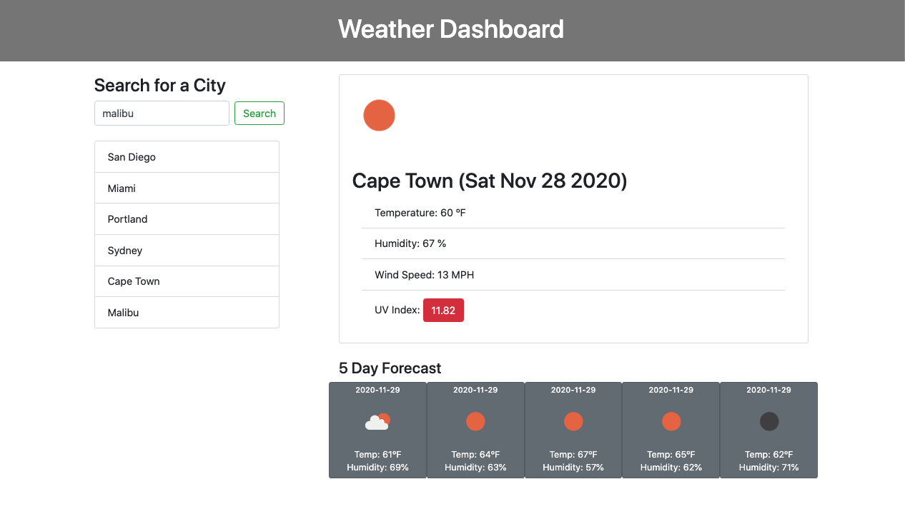
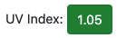
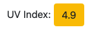
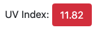

[06-Weather](https://joe-zu.github.io/06-Weather/)

# Weather Dashboard

## Introduction

This simple web application utilizes [bootstrap](https://getbootstrap.com/) and [OpenWeather](https://openweathermap.org/). When the user searches for a city, the application makes an API call to retireve the following data. 

- The city's current weather
- The city's five day forecast
- The city's UV index

Each set of data requires an individual API query to OpenWeather.

### Features 
- Recently searched cities are saved locally
- Saved cities can be clicked to view their weather again
- The color of the city's UV index will indicate the level of caution the user should take

- Icons from OpenWeather's library are used to plainly illustrate the weather

### License
MIT License

Copyright (c) [2020] [Joe Giampaoli]

Permission is hereby granted, free of charge, to any person obtaining a copy of this software and associated documentation files (the "Software"), to deal in the Software without restriction, including without limitation the rights to use, copy, modify, merge, publish, distribute, sublicense, and/or sell copies of the Software, and to permit persons to whom the Software is furnished to do so, subject to the following conditions:

The above copyright notice and this permission notice shall be included in all copies or substantial portions of the Software.

THE SOFTWARE IS PROVIDED "AS IS", WITHOUT WARRANTY OF ANY KIND, EXPRESS OR IMPLIED, INCLUDING BUT NOT LIMITED TO THE WARRANTIES OF MERCHANTABILITY, FITNESS FOR A PARTICULAR PURPOSE AND NONINFRINGEMENT. IN NO EVENT SHALL THE AUTHORS OR COPYRIGHT HOLDERS BE LIABLE FOR ANY CLAIM, DAMAGES OR OTHER LIABILITY, WHETHER IN AN ACTION OF CONTRACT, TORT OR OTHERWISE, ARISING FROM, OUT OF OR IN CONNECTION WITH THE SOFTWARE OR THE USE OR OTHER DEALINGS IN THE SOFTWARE.